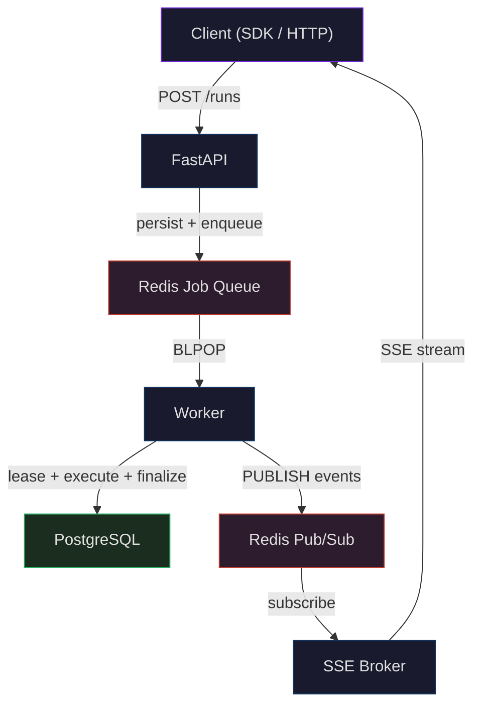
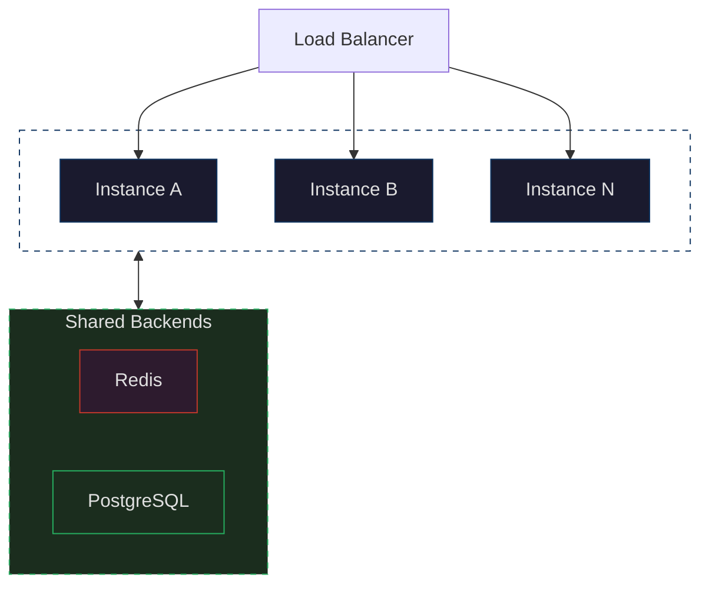
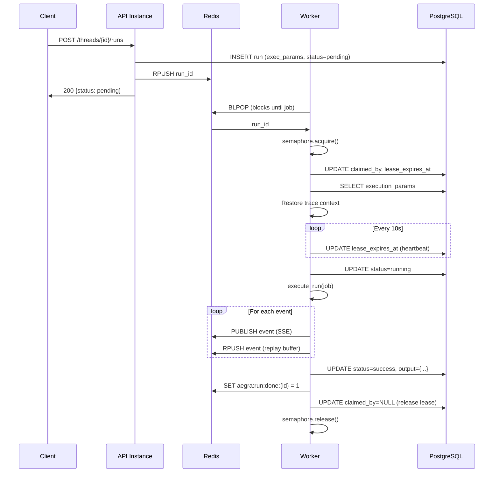
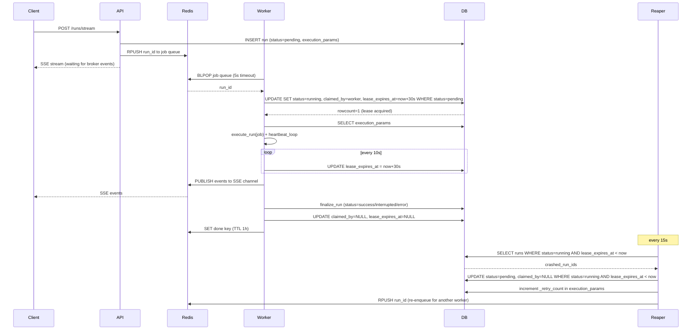
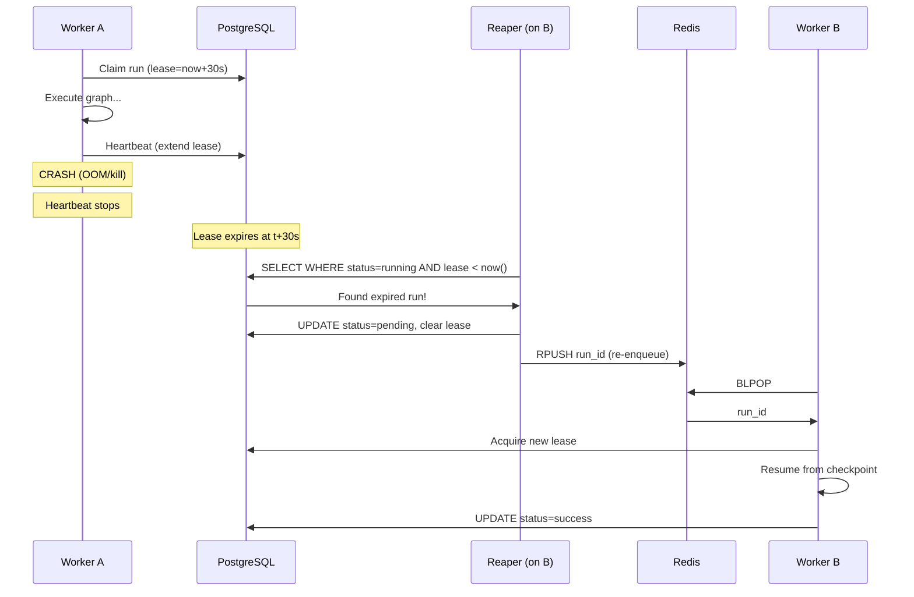
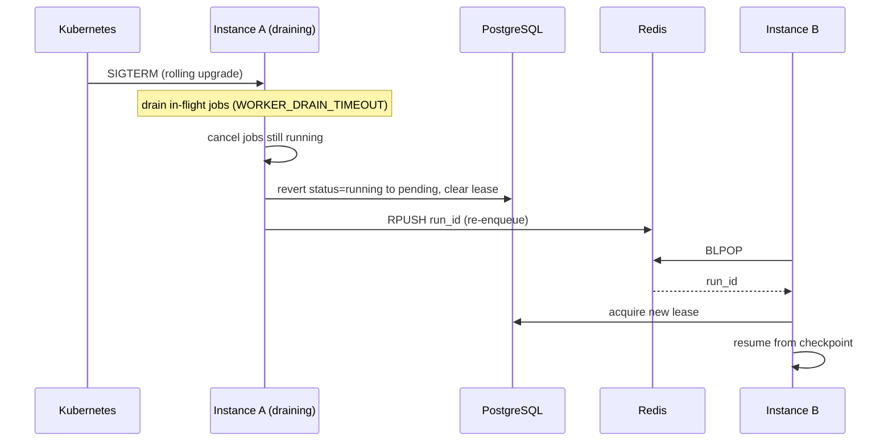
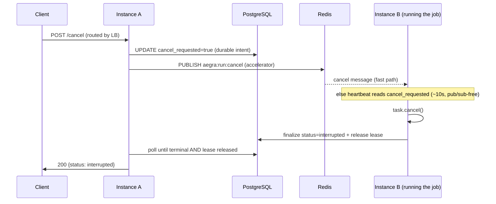

Aegra uses a worker-based execution model for production deployments. Runs are dispatched through a Redis job queue and executed by concurrent asyncio workers across any number of instances. Lease-based crash recovery ensures no run is lost, even if an instance dies mid-execution.

In dev mode (`aegra dev`), none of this is needed — runs execute as simple in-process asyncio tasks.

## Run lifecycle overview

How a single run flows through the system — from client request to completion:

<a href="https://mermaid.live/view#pako:eNqdk1tPwjAUx79KU140QhjDoOzBREQBJaG4GR_Eh3Y7k4ZdtO28Mb673YWxqLywPexc_v-T8-vSNXZjD7CFsB_EH-6SCoWc4SJC-rkKOETqaYGLAB3ZwzvURmPHIccL_FyILslEK26oVDqqqvfgcanr-RfdxgzNE0ig6j_GYgVCC4qgqpORrpFYqhcB9ny6qyfMTlg1UKdtnVftgYiLcbZ9XSZ5r86BWq2LlMxsB7VFEsk027xCyJuvICSXCp0giN6yddOCo4aU6wZTMiNpyVDnybsBUAnZjE9wE5VFPo9owL_1ODL6IycPg-nEHiN41zvqrQrSOnUukwmTruBMDyn5auC5IkOXSgAN05J4yy_VVwDbU_B5EFiNDu1QE5par_1Wo-eZ516_6cZBLKwGGNlb92Yn9K_R8LunPWO_sQQ9yFuyHeQtflZhNb0Oq1ldo9s32X5reeiHeUfbdZl27nzmGYXf6-ImwiGIkHJPX781VksI84voUbHCm80P8HgjAQ==" target="_blank" rel="noopener">View fullscreen ↗</a>

The happy path of a single run, step by step:

1. **Client** sends a run request to any instance via the load balancer.
2. **FastAPI** validates, persists the run to PostgreSQL (with serialized execution params), and pushes the run ID onto the Redis job queue.
3. **Worker** picks up the job via `BLPOP` (blocking pop — instant delivery, no polling).
4. **Worker** acquires an exclusive lease in PostgreSQL, executes the graph, heartbeats every 10s, and finalizes the run (status, output, release lease).
5. **Worker** publishes each event to Redis Pub/Sub for real-time streaming.
6. **SSE Broker** subscribes to Redis Pub/Sub and relays events.
7. **Client** receives events over an SSE connection.

Behind the scenes, the **Lease Reaper** scans PostgreSQL every 15 seconds for runs with expired leases (crashed workers) and re-enqueues them. Workers also send **OpenTelemetry traces** to Langfuse, Phoenix, or any OTLP collector.

## Horizontal scaling

Every instance is stateless — add more instances behind a load balancer to increase capacity. All instances share the same Redis and PostgreSQL backends.

<a href="https://mermaid.live/view#pako:eNqdU1FrwjAQ_itH-qrQ1rmxMgamAxmU0c29rT5cm2jFmkiSMUT870trW9ttOjB5CHfffXff3ZE9ySTjJACyKORXlqMy8P6UCLAnoh8JiSQyoFigyLhKyDwRR1B_pkuF2xyehTYlqG0wVAFQn4n1NChMehDtQrQHhV3opYW4YL9KU8zW1l9WnlnlnLWeXsY3zlZlTPX2kHhq3bHUZqn47DX6q1hEYTh8tPK7Fu1ZYRPbjgIeqqhGTKPb7Ao7CFisiiJwPPTQ5wNtlFzzwHEXo5tbd5DJQqrA4W55uzR6HS28jnbqpKIbhUJv7YSF-ZniaA4ZarsBhbtgDOPzeasV1JJ85qUdSZk7uvfT89R42rSSWuaJ598hvzi4egsX2f93QQZANlxtcMXsb9kTk_NN9W8YqjU5HL4B_SQCkw==" target="_blank" rel="noopener">View fullscreen ↗</a>

Each instance runs multiple worker loops (default 3), and each worker loop handles up to `N_JOBS_PER_WORKER` concurrent runs (default 10) via an asyncio semaphore. Total capacity per instance is `WORKER_COUNT` x `N_JOBS_PER_WORKER` — 30 concurrent runs by default. A job enqueued by Instance A can be picked up by Instance B — any worker can execute any run.

## Job lifecycle

The detailed sequence — every Redis command, database query, and semaphore operation involved in executing a single run:

<a href="https://mermaid.live/view#pako:eNqNU9Fum0AQ_JUVTyC5ttNHJEdKHJpaQgkFW36JhI5jY18Nd-TuiGxZ_vcuhrRQWrW8nMTM3M7O7p0drnJ0fHAMvtUoOT4IttOsfJFAX8W0FVxUTFpYAjOwLARKOwbvolUDN8dKGsvoojEpbigx5sKMsW2DbZU-oB6D0WODRsrYncbkW_giW87y0-0tlfQhek7WMLN7jSw3s7PILzNdy64MMYgXPfqwekqCeA0EgYtH5CkVYaWZADm2tVlUKHMhd15fF_sQR5vka6NKRd6Hlj58ns_h3Kp96OSXD3vbVn4fRs8RuFmh-MFALa0o4LvKuioxkbb-4PZt-8tgyaq90jhl_K0WGl3vF960s4ke7tYB8IKJEvM0O02gQGYwxWNFdJMyOxQkQRgs19C0XluhZNf_oGqMxlJNsJpxBK6kxaP96KhQqoLgHfUJbuad7g-OfncB7h5pnBky27VASfVT6mm7UVAekrIcWGt9Y0qY2wbYc_VFaUDG94DvPze0N4Rocx-uaIpXFNwkCbwRp51zx9BYFewEWf36ivp_XZuaczS0UKq2VW0X5-l0ehksQxKsgSG9MJ-68HMl0W_WFRZw84_hLp42Ydj4uqbbZuz9ZWE6kus5E3BK1CUTOT3ys2P3WF6fe870wblcfgAuaUK2" target="_blank" rel="noopener">View fullscreen ↗</a>

Key details:

1. **Execution params** are stored in PostgreSQL alongside the run, so any worker can reconstruct the full job context (user identity, config, trace metadata, interrupt settings, etc.).
2. **Lease acquisition** is atomic — `UPDATE ... WHERE claimed_by IS NULL` ensures only one worker wins the race.
3. **Heartbeats** extend the lease every 10 seconds (by the DB clock), and read the `cancel_requested` marker in the same round-trip. If a worker crashes, the lease expires and the run becomes eligible for recovery.
4. **OpenTelemetry trace context** propagates across the Redis queue boundary, so traces span the full request lifecycle.
5. **Thread state** is materialized from the checkpointer snapshot (`graph.aget_state()`), the single source of truth — never from the run's stream output, which is empty under non-`values` stream modes. The stream output still populates `run.output` (a separate field); only the materialized thread state comes from the checkpointer.

### Streaming run with crash recovery

The full picture — a streaming run shows how the client SSE connection, worker execution, and reaper recovery all interact:

<a href="https://mermaid.live/view#pako:eNqdVE1r4zAQ_SuDTw5tScPSi9kUksbQQEhN7NDLglHsaaNNLLmSvGm29L_vyHK-ncv6ZEYz8-a9edKXl8kcvQA8jR8VigxHnL0rVvwSQF_JlOEZL5kw8LTmKMxlfBCNL4MzzLm-DL9KtUJ1GR8N21qw0ua6E4d-9_hIcAFEL3ECXVUJ3dVG4W5cOqOM0TCA8TQOZwlQBvjaMFPpfoki5-L9FvATs8pwKVKCY4XuHBfXgwcwi-bxsy1PeQ5Gwm-5ANKnwkMuJbuhAojjENwc4G8YNwQDb1LBQkmiC_iHsiyMK3YiHLCGk-glOiCA_6DB8AJlZZrR6kQL6EqDZrCzdpb3PBoNkhDiMIGGNqWKmna2ZtQ0Txfb_qYuuYU1Mo0pfpZcoU6Z6Qu5uflxr-H1OZyFcCqcQxsNT-aQm0xWwvR74NfNgGUfFXXLOy3DxeEkfEou9D_L3PV2aZgSAZ_E6cANLJH8sUBm0rWUpauzf1ZhtYXefdPrmiznfKEPDWNXR0TbVxTNh5MxGcJt0hrCrjxbMiFwfbajY1O4_BYp3rhga_63Zrd3qK6yDLXucmFQqao0mHfpR6rO9U0fbXU6n0xadmrD7aysS3IpEFa4BT9JJtBb7l06lQZBkq7NRQx2Ij_oHWEbPl2tvZGn5mnsB4Pp6FL-n1b-Y1_toDLF9JJYOZ-3ATb0z-_2mRz_N8sJEBeZwoLWCKlCo7ZpbXgKX_HxvrjtJfEV3qFw19w-EExIsySJ3YXseLfgFagKxnN6kr88OivqxzlnauV9f_8DKe3lLA==" target="_blank" rel="noopener">View fullscreen ↗</a>

## Crash recovery

Every instance runs a `LeaseReaper` background task that scans for runs with expired leases. When a worker crashes (OOM, kill signal, network partition), its heartbeat stops and the lease expires. The reaper resets the run to `pending` and re-enqueues it. The new worker resumes from the last checkpoint.

<a href="https://mermaid.live/view#pako:eNptk09PwkAQxb_K2FOJiCbeGjVpocIBpRZJLyZm3Y6wge7W_aMkxO_uLK2CQE9N9r3fezPtbgKuSgwiCAx-OJQcB4LNNateJNBTM20FFzWTFooYmIFC6SVqiI_Ps6E_z5Sxc43Tp_GxIkdWk5dU7VuoJCSdE8JGUwpzokayVyN5kY2iiC_u7rJhBP0VExVoJyFcITN4K9XX-fWV6ezpijiCdI3cWQSatV70er0DzAgp8g2ZhRDXFmUJW1rnN-9RkVd9UgUP6-fxdAThZPJwuRSrVeeUZkc0VtXmGORjxz4EcF0LjQZIa333X22ztbbhNB2n_WcoRmmeEpJZZ25pbCnkHOLHQdMXboDmD9tC2ZC8DSSCe-Voqiaq9As7OxEyywbx8x--pj0Qvguc4LpJODDlEeTZjJZBwFdRQqjxAiX9WW63uyJphMk4m2St33-VJGpdezJfIuYfjkqCxK_9zO25N-VoXIXwrlUFfIF8WSsh7QHk_yTGcY7GBF0IKtQVEyVdgU1gF1htL0PJ9DL4_v4BvGz9cA==" target="_blank" rel="noopener">View fullscreen ↗</a>

The reaper runs on every instance (default every 15 seconds). This is safe — the atomic lease acquisition prevents duplicate execution.

Lease timing uses the **database clock** (`now()`), not each pod's wall clock: the expiry is written as `now() + interval` and the reaper compares against `now()` on the DB server. With per-pod wall clocks, a reaper whose clock ran fast could reclaim a lease that was still valid on the writer's timeline — briefly double-running the run. Deriving both the write and the comparison from one authoritative clock removes that window.

## Graceful shutdown (rolling upgrades)

On `SIGTERM` (K8s rolling upgrade, scale-down), each instance drains its in-flight jobs for up to `WORKER_DRAIN_TIMEOUT` seconds. A job that finishes within the window completes normally. A job still running after it is **handed off, not killed**: the instance reverts the run from `running` back to `pending` (clearing the lease) and re-enqueues it, so another instance resumes it from the last checkpoint.

Crucially, a drained run is **not** written as terminal `interrupted`. The reaper only recovers `running` rows with expired leases, so an `interrupted` row would be a dead end — the in-flight work would be lost on every deploy. Reverting to `pending` keeps it recoverable (immediately via the re-enqueue, or via the reaper's stuck-pending sweep as a backstop). No retry budget is charged, since a deploy is not a failure.

<a href="https://mermaid.live/view#pako:eNptku9KKzEQxV9lyKcK7QssKOxi6S1Vu6aVBVkoMZluo9lkTSZeLuK7m9xuoVLzIeTP78w5Q_LJpFPIChbwPaKVeKtF50XfWkhjEJ601IOwBCsQAVbxBb1FwnAJNGUmljaQSHWghInyQlttu6tLuF5kuHaBOo-bx7tLgmeAo9K_WVU_rKrWHpnV7OamKQvYLBfbOb-HiXfGpAAQh9SUwjHIgyME94EeMvw_JWg72xvdHQhe3UuASbPmqznf3fJy-bDbLu_n66ftKG_K0UZmd3MUBNLGgI82N3zG1YsCPCYvSoigGK5HBsjBgFal5RSkQeEhTQHPtLwAXj9t_uSyO61SOzhDm94pnjppqiNW3dXr-njEZzldVYyiMy5HEfI9ao9g8e8Pu-okwhB7hL13PcgDyrfBaUtsynr0vdAq_ZTPLGkZHbDHlhVpqXAvoqGWtfYroSKS2_yzkhXkI05ZHJSg08c6HXoXuwMr9sKEtEuv-uzcePn1DcLM2FE=" target="_blank" rel="noopener">View fullscreen ↗</a>

## Cross-instance cancellation

Cancel requests can arrive at any instance, but the run may be executing on a different one. Cancellation is **durable**: the API persists the intent to a `cancel_requested` column on the run, and the owning worker's heartbeat reads that flag in the same round-trip it already makes to extend its lease (every ~10s). So a cancel is honored even if the Redis pub/sub signal is dropped — and even survives a worker crash, since the reaper re-enqueues the run with the marker intact. Redis pub/sub is kept as an **accelerator** for near-instant cancellation on the fast path.

The **executor**, not the API, writes the terminal `interrupted` status. This closes a race the old pub/sub-only path had: a dropped message let the run finish and overwrite `interrupted` back to `success`. Because the marker guarantees the worker self-cancels, the worker is always the one to finalize.

`wait=1` and `rollback` block on the executor's own settle signal — **terminal status AND lease released** (`claimed_by IS NULL`) — not on a status the API pre-wrote. A prod worker writes the terminal status in `finalize_run` but only drops its lease afterwards, so the lease-release is the definitive "worker is fully done" point. This is what makes `rollback` safe: checkpoints are deleted only after the worker has stopped touching them.

<a href="https://mermaid.live/view#pako:eNplkl9r2zAUxb_KRU8pS9Zsj4IW7GR0hdB5SfsyDOPavna0yZKnP4MudJ99V7XDUuwHW_j-zjm6VzqJ2jYkpPD0K5Kpaauwc9iXBvgZ0AVVqwFNgA2gh41WZMK8mKXivfEB2QKyOVDcJaKwPnSODl93c2KfgD01ys9r-Rv7HBYuGqNMB-FI8MNWV6UZRZvV7W0mofhyeITrOtGaYRsDNVA9wy6_GrmMueJOwlOxzR4_wUh-d2kGntmb4CLBookOK02gTOCuL6R7jnjKd_eHz4DE45K8H3mOw5o_5DBYN0n2K9bkcoqBnrzHjv1b9IH7DMeJe7CBwP4mBwyT9gRH4ilUhAEcYeNnG4XF3w9rv4QhVtc-VqvWEU1m-ZgZ0P98P8oWF5XUfKsMavWHgOcaor9JbToXh-T7jgM1IW_h9f12aoPVGqIJSgMr-mQD2cN2RM_C5r9mI-Hjeg2nMUfCRdCLWIqePVA1fAlPSVMKPtWeSiF52VCLUYdSlCahGIM9PJtayHRCSxGHBsP5zp5_8nl3RyFb5AkuBV-gb9ZOxZd_RtH48A==" target="_blank" rel="noopener">View fullscreen ↗</a>

## Dev vs production mode

| | Dev (`aegra dev`) | Production (`aegra up` / `aegra serve`) |
|---|---|---|
| Executor | `LocalExecutor` — `asyncio.create_task()` | `WorkerExecutor` — BLPOP + semaphore + lease |
| Redis required | No | Yes |
| Crash recovery | No (single process) | Yes (lease reaper) |
| Cross-instance cancel | N/A | Yes (Redis pub/sub) |
| SSE broker | In-memory queue + list | Redis pub/sub + replay buffer |
| Scaling | Single instance | Horizontal (shared Redis + PostgreSQL) |

<Tip>
  `aegra dev` is designed for fast iteration — no Redis, no workers, no leases. Just start coding and your runs execute immediately in-process.
</Tip>

## Redis data layout

| Key | Purpose | Written by | Read by |
|:----|:--------|:-----------|:--------|
| `aegra:jobs` | Job queue (BLPOP) | API (RPUSH) | Worker (BLPOP) |
| `aegra:run:{run_id}` | SSE live events | Worker (PUBLISH) | API (SUBSCRIBE) |
| `aegra:run:cache:{run_id}` | SSE replay buffer | Worker (RPUSH) | API (LRANGE) |
| `aegra:run:counter:{run_id}` | Event sequence counter | Worker (INCR) | API (GET) |
| `aegra:run:cancel` | Cancel commands (accelerator only) | API (PUBLISH) | Worker (SUBSCRIBE) |
| `aegra:run:done:{run_id}` | Completion signal (TTL 1h) | Worker (SET) | API (EXISTS) |

<Note>
  The durable source of truth for cancellation is the `runs.cancel_requested` column in Postgres, read by the worker heartbeat — not the `aegra:run:cancel` pub/sub channel, which only accelerates the fast path.
</Note>

## Configuration

All worker settings are configured via environment variables. See the [environment variables reference](/reference/environment-variables) for the full list.

| Variable | Default | Description |
|:---------|:--------|:------------|
| `REDIS_BROKER_ENABLED` | `false` | Enable Redis workers and broker |
| `REDIS_URL` | `redis://localhost:6379/0` | Redis connection URL |
| `WORKER_COUNT` | `3` | Worker loops per instance |
| `N_JOBS_PER_WORKER` | `10` | Concurrent runs per worker loop |
| `BG_JOB_TIMEOUT_SECS` | `3600` | Max execution time per run (1 hour) |
| `BG_JOB_MAX_RETRIES` | `3` | Max retry attempts before a crashed run is permanently failed |
| `STUCK_PENDING_THRESHOLD_SECONDS` | `120` | How long a pending run can sit before the reaper re-enqueues it |
| `LEASE_DURATION_SECONDS` | `30` | Lease TTL before reaper reclaims |
| `HEARTBEAT_INTERVAL_SECONDS` | `10` | Lease extension frequency |
| `REAPER_INTERVAL_SECONDS` | `15` | Expired lease scan frequency |
| `POSTGRES_POLL_INTERVAL_SECONDS` | `5` | Fallback poll interval when Redis is unavailable |
| `WORKER_DRAIN_TIMEOUT` | `30.0` | Graceful shutdown wait time (seconds) |

<Note>
  When Redis is unavailable, workers fall back to polling PostgreSQL for pending runs at `POSTGRES_POLL_INTERVAL_SECONDS` intervals. This keeps the system functional during Redis outages, though with higher latency.
</Note>

## File map

| File | Purpose |
|:-----|:--------|
| `services/executor.py` | Factory — selects `LocalExecutor` or `WorkerExecutor` |
| `services/base_executor.py` | Abstract interface: submit, wait, start, stop |
| `services/local_executor.py` | Dev mode: `asyncio.create_task` |
| `services/worker_executor.py` | Production mode: BLPOP + semaphore + lease + heartbeat |
| `services/run_executor.py` | Shared execution logic (used by both executors) |
| `services/run_status.py` | Database status updates |
| `services/run_preparation.py` | Run creation (validate, persist, submit) |
| `services/lease_reaper.py` | Background task recovering crashed worker runs |
| `services/broker.py` | In-memory broker + factory |
| `services/redis_broker.py` | Redis pub/sub broker for SSE |
| `services/streaming_service.py` | SSE orchestration (replay + live) |
| `models/run_job.py` | `RunJob` Pydantic model (serialized execution params) |
| `core/orm.py` | Run table with `execution_params`, `claimed_by`, `lease_expires_at`, `cancel_requested` |
| `core/active_runs.py` | In-memory task registry (dev mode only) |
| `core/redis_manager.py` | Redis connection pool singleton |
